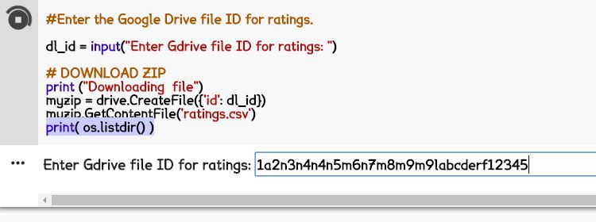

This repository includes the Google Colab notebooks used to clean the original goodreads data, train the book vectors, and analyze the vectors. 

# Files

These notebooks requires the 'ratings.csv' and the 'books.csv' files which are described here

http://fastml.com/goodbooks-10k-a-new-dataset-for-book-recommendations/

and can be found here

https://github.com/zygmuntz/goodbooks-10k

In addition to these files, you can use my latest checkpoint to either continue training on the embeddings, or analyze the embeddings. Links to the checkpoints 
are located in the TensorFlowCheckpoint folder. 

These notebooks are set up to download these files from your Google Drive, and will ask permission to access your Google Drive. So if you would 
like to use these notebooks as is, download the files from the link above, and upload them to your Google Drive. 

The notebooks will ask for for the file ID of the files. To get the file ID, right click on the file in your Google Drive, and select 'Get shareable link'. Something like
this will be copied: 

"https://drive.google.com/open?id=1a2n3n4n4n5m6n7m8m9m9labcderf12345"

The numbers after the '=' sign is the file ID. Copy just that part 

"1a2n3n4n4n5m6n7m8m9m9labcderf12345"

And paste it. For example

# Notebook Descriptions

There are 3 notebooks in this repository; their names are Book2VecAnalyzeEmbeddings.ipynb , Book2VecTraining.ipynb, and GoodReadsDataClean.ipynb. 

GoodReadsDataClean.ipynb is the code I used to analyze and clean the data. 

Book2VecTraining.ipynb is the code I used to train the data. 

Book2VecAnalyzeEmbeddings.ipynb is the code I used to analyze the embeddings. 

(more instructions coming soon)
