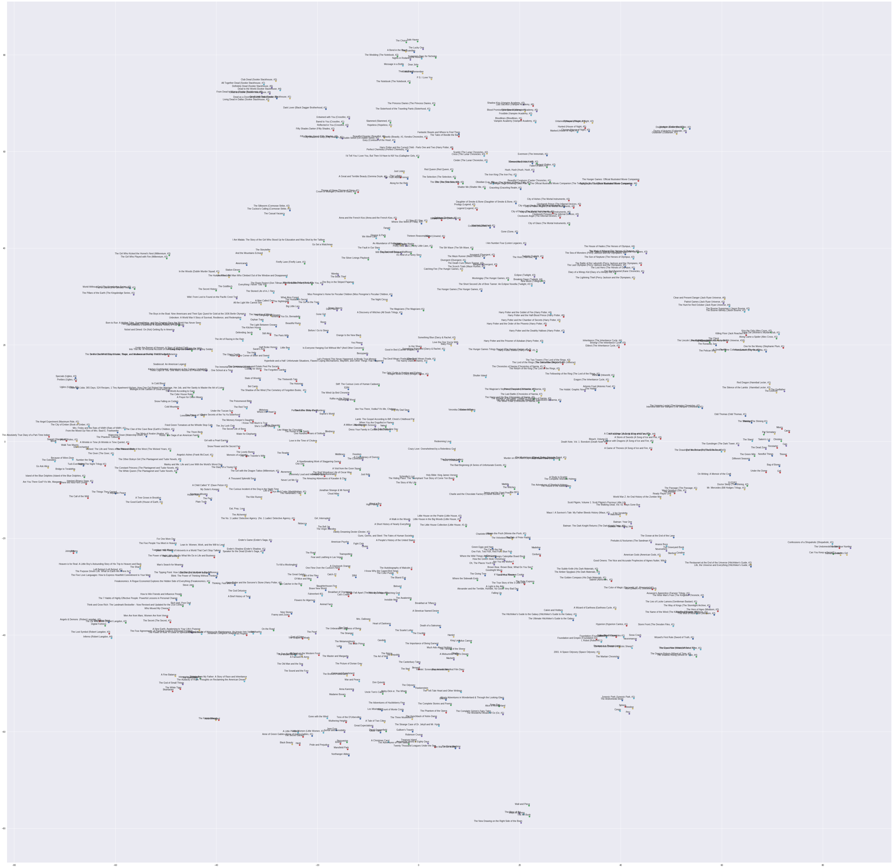

# Book2Vec

Representing Books as vectors using the Word2Vec algorithm 

Using the Cbow version of the Word2Vec algorithm on Goodreads data, vectors were trained to represent books. 

This repository includes Google Colab notebooks used to analyze and clean the original goodreads data, train the book vectors, and analyze the vectors. 

These notebooks requires the 'ratings.csv' and the 'books.csv' files which can be found here

http://fastml.com/goodbooks-10k-a-new-dataset-for-book-recommendations/

These notebooks are set up to download these files from your Google Drive, and will ask permission to access your Google Drive file. 

[[https://github.com/Santosh-Gupta/Book2Vec/blob/master/Images/goodreads.png]]

