# Book2Vec

(In progress, will be updating over the next week)

Using the Cbow version of the Word2Vec algorithm on Goodreads data, vectors were trained to represent books. 

This repository includes the Google Colab notebooks used to clean the original goodreads data, train the book vectors, and analyze the vectors. 

These notebooks requires the 'ratings.csv' and the 'books.csv' files which are described here

http://fastml.com/goodbooks-10k-a-new-dataset-for-book-recommendations/

and can be found here

https://github.com/zygmuntz/goodbooks-10k

These notebooks are set up to download these files from your Google Drive, and will ask permission to access your Google Drive. So if you would like to use these notebooks as is, download the files from the link above, and upload them to your Google Drive. 

The following images are from a 2D TNSE plotting the resulting book embeddings. This particular TNSE plotted 3000 books (out of 10,000 book vectors that were trained)

This section maps contains modern fantasty/high fantasy. 

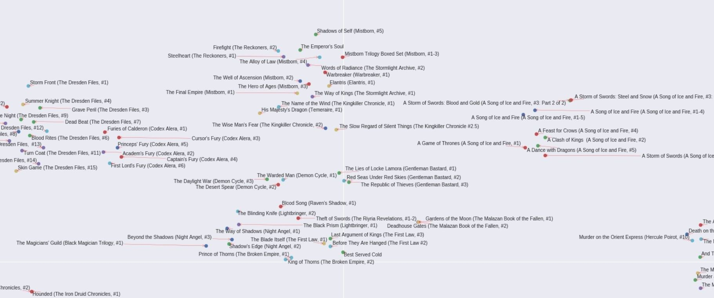

The secton in the middle has mostly comic books with sci books sourrounding it. Near the bottom is Neil Gaiman's graphic novel series Sandman. 

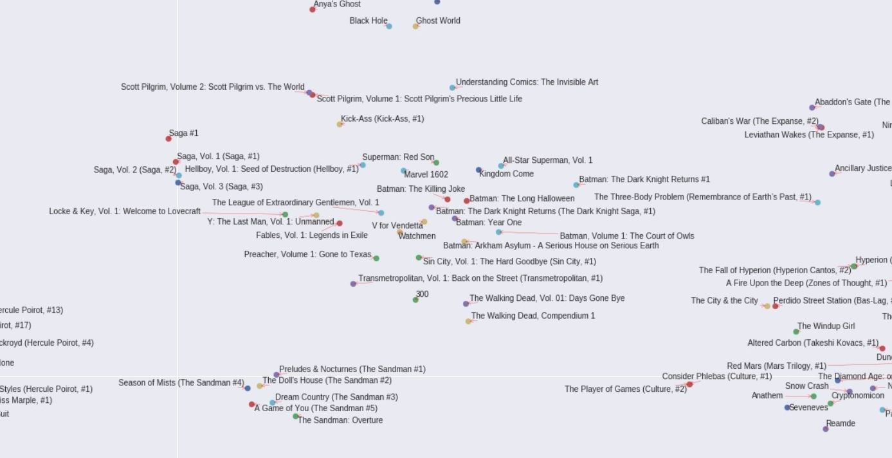

This section has space-focused sci-fi. There's a small section of Chuck Palahniuk books to the right. 

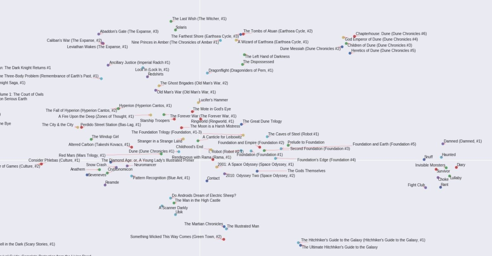

The books at the top as Neil Gaiman's. I'm not familiar with the other books but they seem to have an element of Neil Gaiman's style of paranormal/magic/sci-fi with a humorous style. 

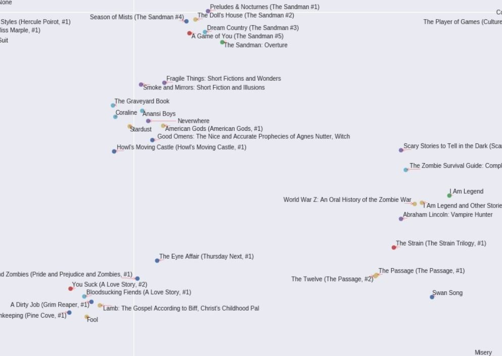

Classics which seem to be grouped by time-period and author. 

The top right is having a Stephan King party and the bottom left side having a Michael Crichton party. Perhaps they're grouped together because their books have a thrilling / horror quality. The Dark Tower books which have more of a fantasy quality are placed on the opposite side of Michael Crichton books. 

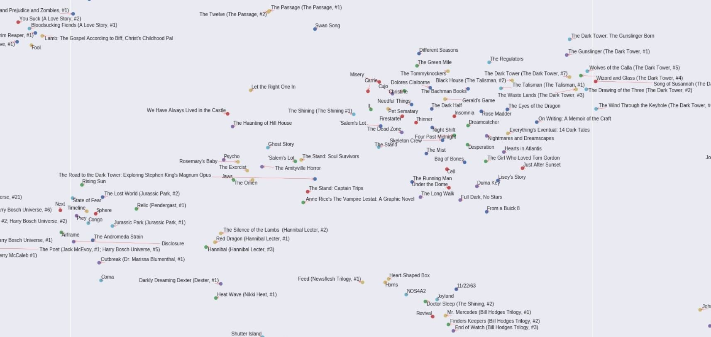

Classic childrens' books. The majority of the ones on the bottom left are picture books. Roald Dahl has his own section on the top right. Paddington and Winnie thePooh seem to enjoy each other's company. 

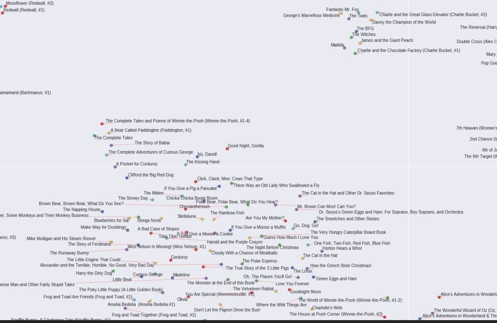

Top right has some classic plays. To the bottom left of that there seems to be writings that tend to be cited as having significant cultural influence (Utopia, The Communist Manifesto, The Republic, The Prince, The Art of War). Further left are more classics. At the left there's a section for Kurt Vonnegut books. At the bottom there's many early to mid 20th century classics. On the right there's a section of books by Charlotte Brontë and Jane Austen.

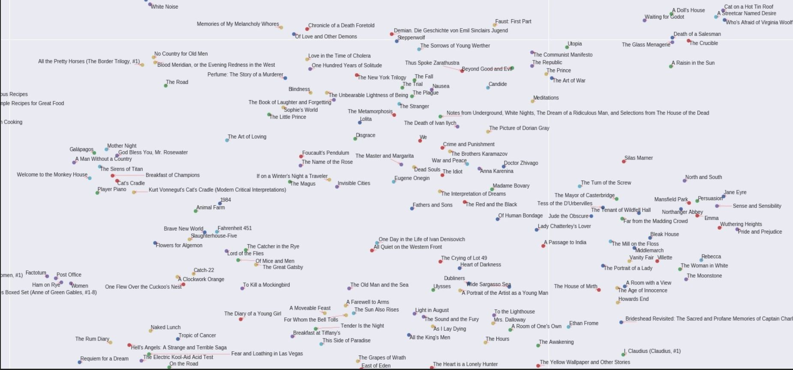

Lots of classic non-picture childrens books on the left side. Lord of the Rings and CS Lewis books on the right. 

This section has modern (90's to current) childrens books series. A Series of Unfortunate Events. Harry Potter, Artemis Fowl, Alex Rider, Inkworld, Inheritance Cycle, etc. 

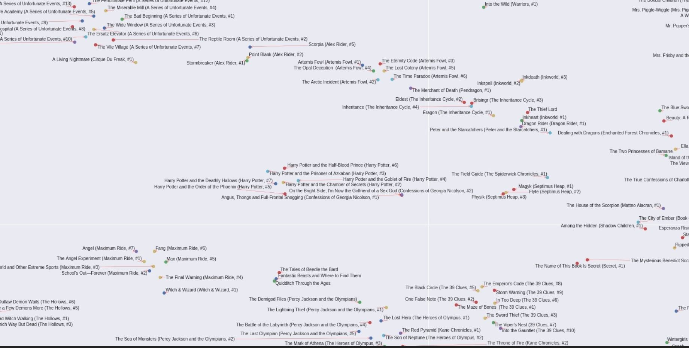

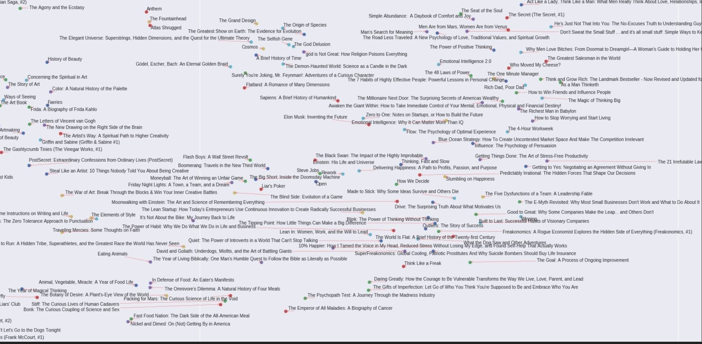

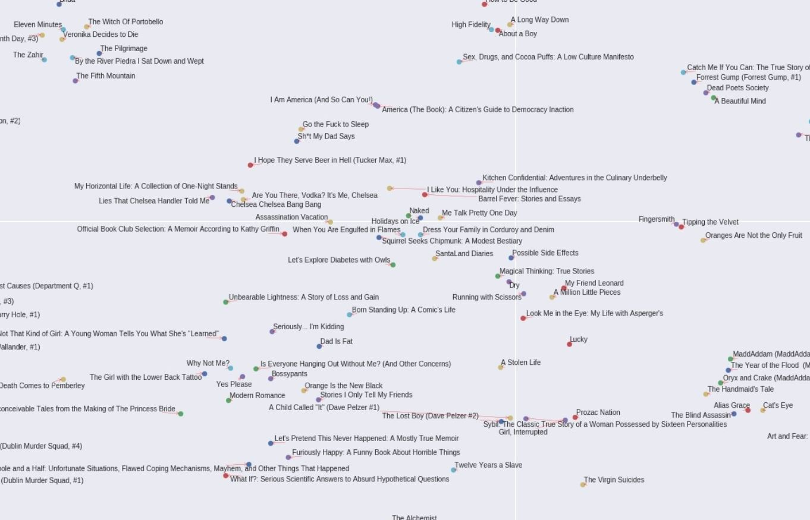

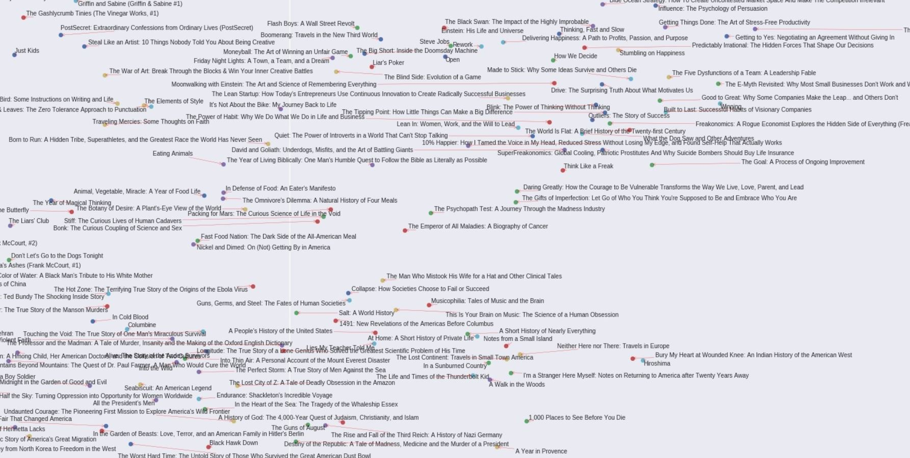

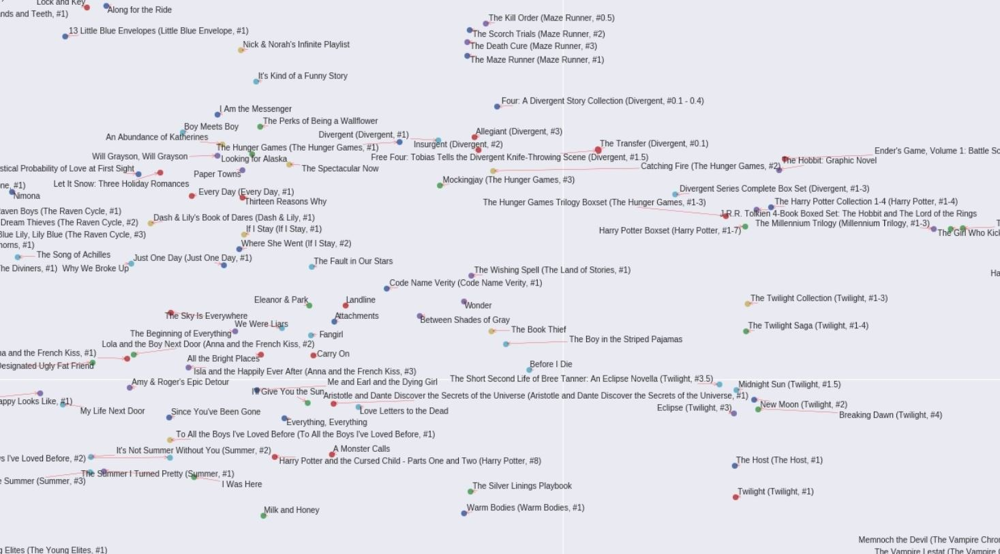

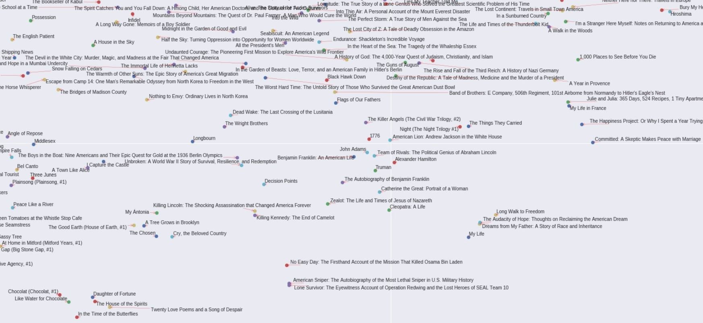

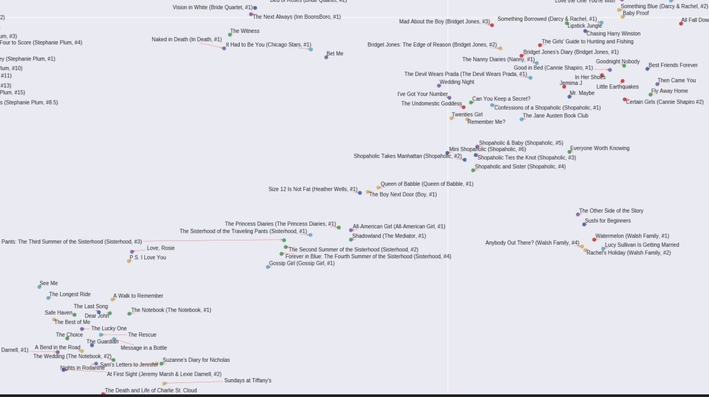

Full map of the 3000 vectors. 

The following images show samples of the similiarity properties of the book vectors. 

 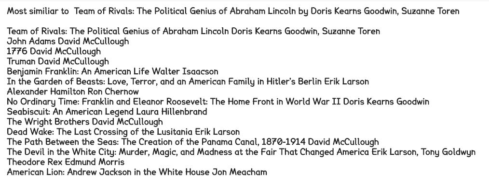
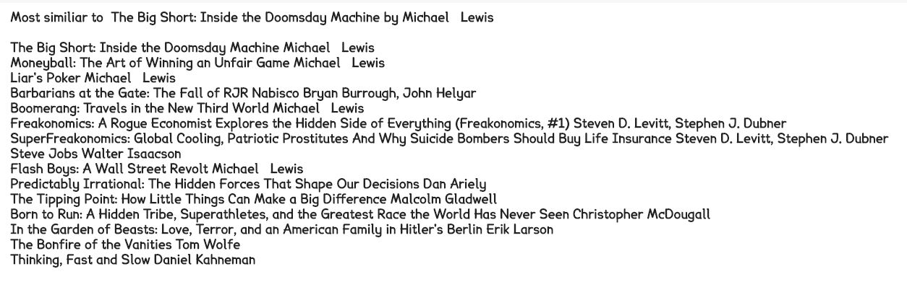 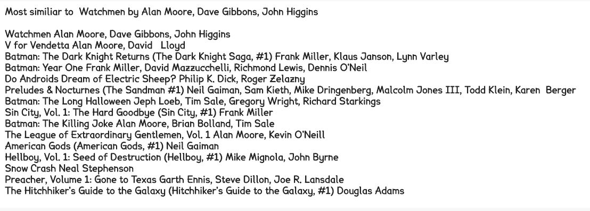
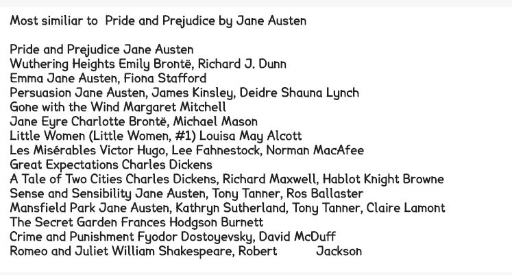 
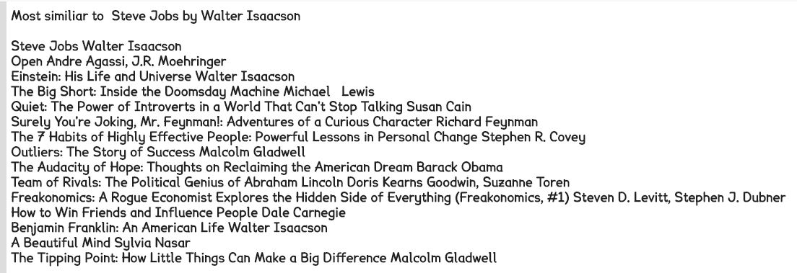

The following images show some of the arithmetic properties of the book vectors. Although these properties are not as robust as word vectors' arithmetic properties, I hope to improve these with better hyperparameter optimization and more data. But in the meanwhile, here are some of the more interesting results I found. 

Vampire Classic - Vampire = Classics

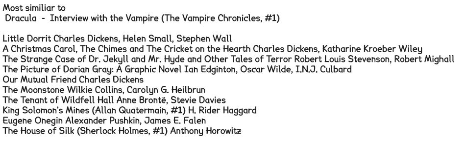

Twilight Graphic Novel - Twilight + Coraline = Coraline Graphic Novel (in top 2 vectors returned)

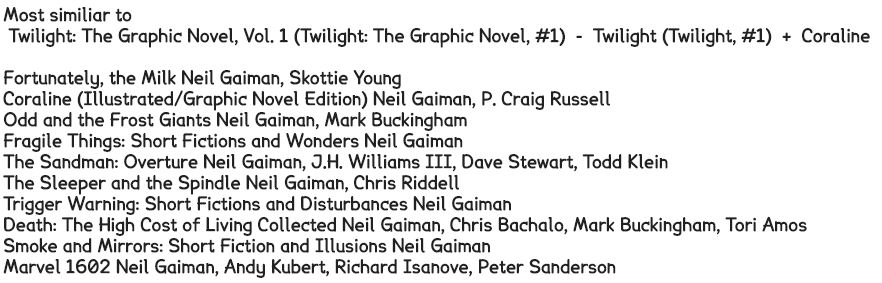

Winnie-The-Pooh + Eastern Philosophy =  Pooh Eastern Philosophy

Romance Classic - Classic = Romance 

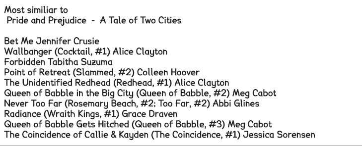

Neil Gaiman Childrens' - Neil Gaiman = Childrens'

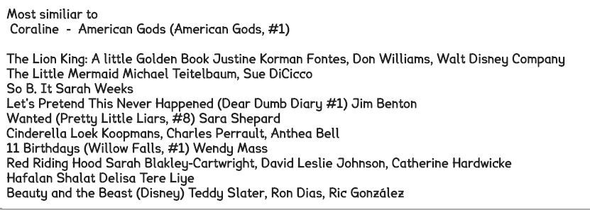

Vampire Romance - Vampire = Romance

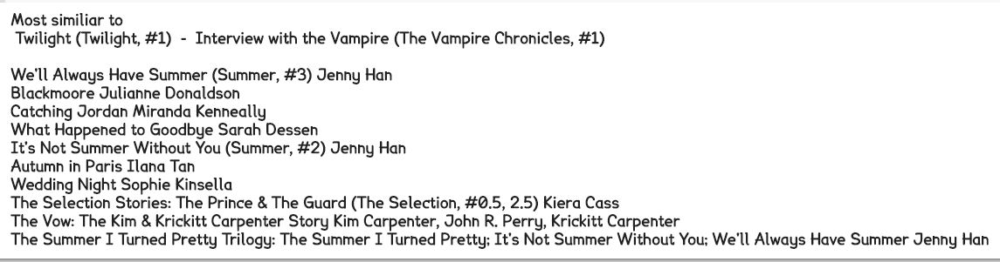

